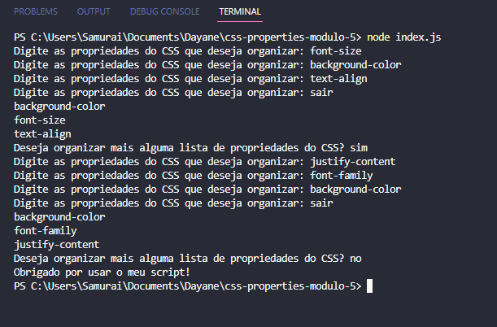

<h1 align="center">css-properties-modulo-5</h1>

Foi usado `npm init` para criar o package.json.

Em seguida foi instalado o prompt-sync com o comando `npm i prompt-sync`.

Usa-se `node index.js` para rodar o arquivo.

Atribuiu-se uma função com o comando while que para quando digita-se "sair" e que armazena dentro dele o que for digitado em uma lista ordenada.

Utilizou-se as funções push() para colocar o conteúdo da string dentro do array, pop() para remover o último item adicionado na lista, que no caso é o comando utilizado para parar a aplicação "sair", sort() utilizado para colocar os itens da lista em ordem alfabética e map() listando os itens um por linha no terminal.

A função main() é utilizada para armazenar a função principal e irá rodar até que se digite algo além de "sim" na resposta.

Exemplo do script funcionando no terminal: 

